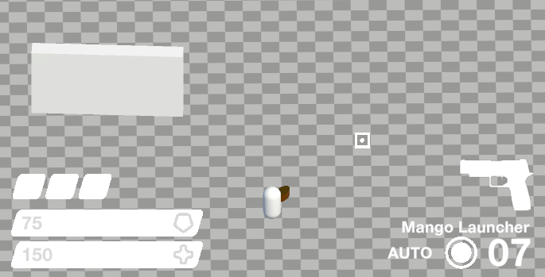
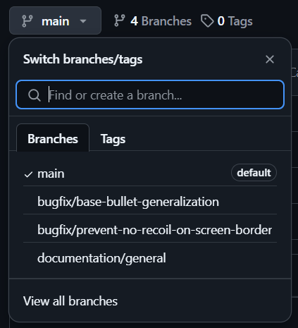
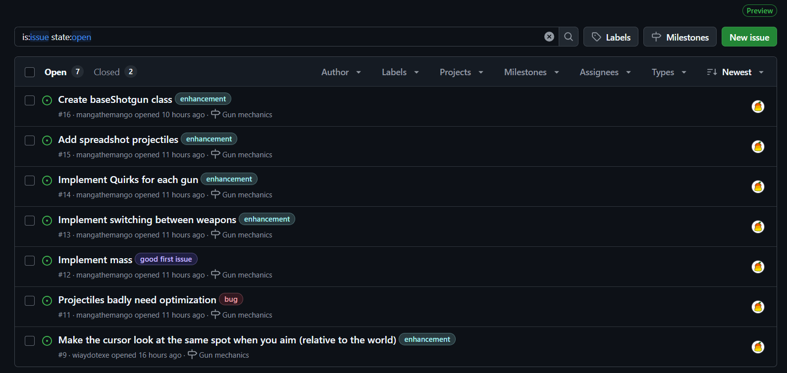
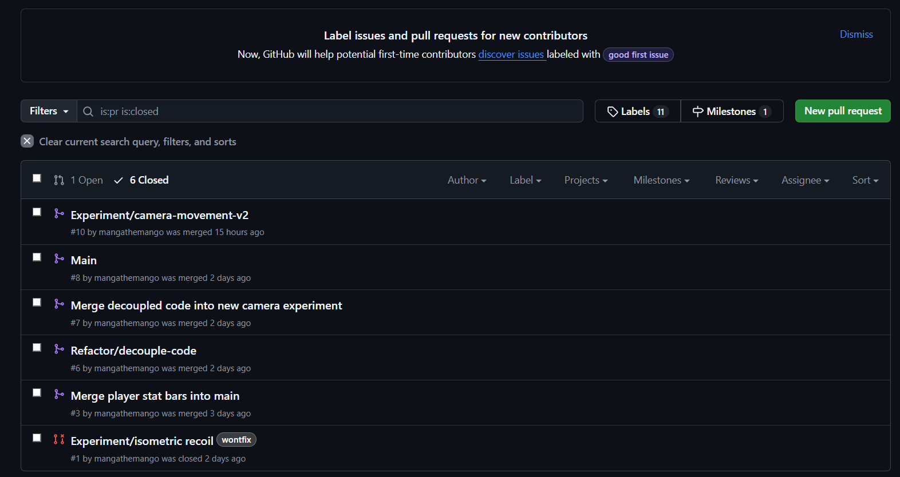
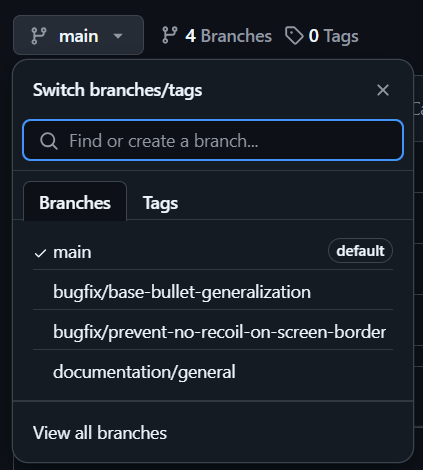
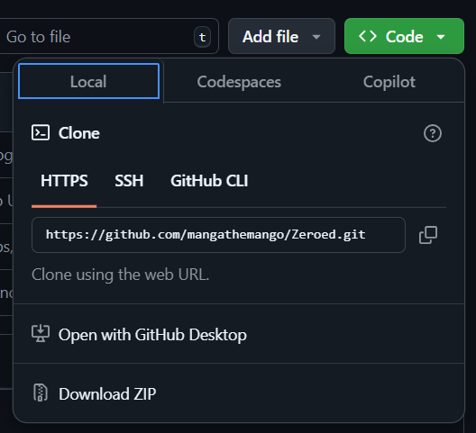
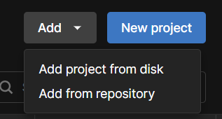

# ZEROED v0.1

***(This readme file is still in progress)***

Zeroed is a 2.5D roguelike shooter game made in Unity6 (6000.0.37f1). The 0.1 version focuses on the game's core mechanics, such as gun mechanics, world generation, and so on. Right now, it will be 100% public, but if this project gets big enough (and the contributers learn how to use git), I will set this to private

## If you're a contributor

Here's a complete guide on how this github thing works

### If you're new to github

#### What is github

TLDR, using github is like using protection. I can wreck up my code real bad and then just revert to a previous version of my codebase. Not only that, it also allows for multiple people to work on the same project at the same time. Very nice for collaboration.

Another thing that's worth mentioning - even personal projects can and should be pushed on to github. This is not only so that your code has a fallback plan in case it breaks, but your github repository can also be put in your CV as experience as well. All in all, ***Every programmer should have a github account*** 

Also, contrary to popular non-programmers beliefs, ***Github is used not always used for code.*** Many a time, a github repository is a means to communicate between users and developers (esp in the [Issues tab](#issues)). 

#### Branches

Another really useful thing github has are ***branches***. It allows you to work on many different features at the same time. This allows for us to work on different features without affecting the main codebase.

ANY new big features/actions should have a separate branch. This is to ensure that the main branch is always playable without any problems.

You can view different functionalities that's being developed inside this tab

#### Issues

This is basically a ***to do list*** for the project. New features are tagged "enhancement". Bugs are tagged "bug". You can even recommend experiments with the "experiment" tag. Any recommendations and stuff can be posted up here.

#### Pull requests

Pull requests are used whenever you want to merge branches together. For example, when I'm done with the X feature in the feature/X branch, then I can create a pull request to merge it into main.

This is essentially useful if you want to add files and allat into the repository

### How to play test the game without git (or even without a github account) (Quick setup)

This is a quick setup for downloading the game to your device.

- Step 1: Download Unity Hub, and Unity Engine version 6000.0.37f1
- Step 2: Navigate to the branch you want to play test. For example, check out "bugfix/prevent-no-recoil-on-screen-border" to see the lastest bug fix on this problem. 

- Step 3: Go to the ***Code*** tab, and select "Download .zip"

- Step 4: Extract the files

- Step 5: Open Unity Hub, click "Add project from disk", and select the folder you just extracted

- Step 6: Click on the project, and you're done!

The bad thing about this approach is that whenever there's a new feature 

### How to play test the game using git (Recommended)
