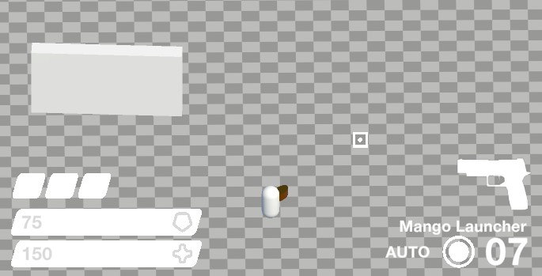

# ZEROED v0.1

***(This readme file is still in progress)***

Zeroed is a 2.5D roguelike shooter game made in Unity6 (6000.0.37f1). The 0.1 version focuses on the game's core mechanics, such as gun mechanics, world generation, and so on. Right now, it will be 100% public, but if this project gets big enough (and the contributers learn how to use git), I will set this to private

